# Create an EMF implementation of the Address Book

## Introduction

In this exercise, we'll build an editor for contact addresses.
We'll give you the interfaces to the business layer and you'll do the rest (that is, with a LOT of help from EMF).

The below instructions assume that you are in a brand new workspace.

## 1. Create a new EMF Project

From the Menu bar, select `File` --> `New` --> `Other`.

Next navigate to the New EMF Project options.

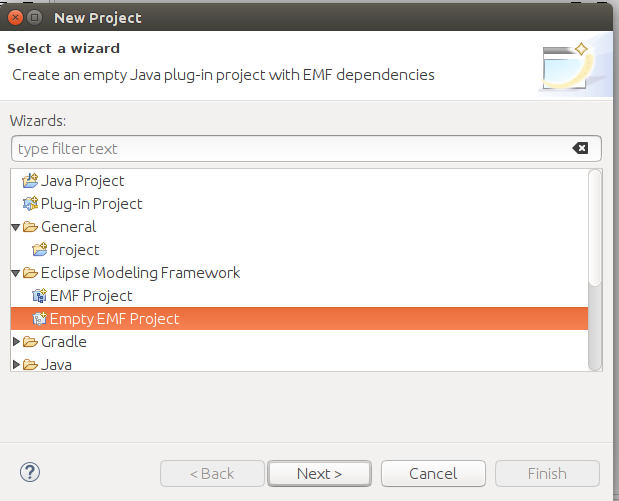

Click `Next`

Enter the name `com.scispike.addressbook` as the project name.

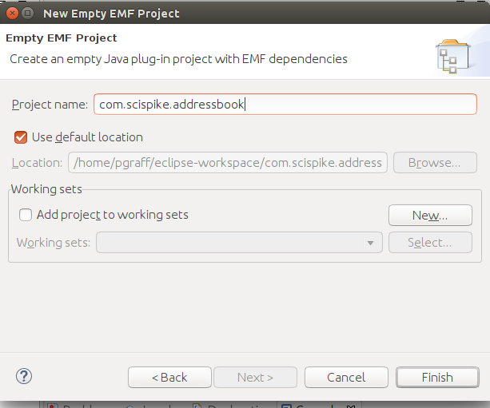

Click `Finish`.

At this point you have an EMF project without any models.
This project feel like (and it actually is based on) a standard Java project.
The difference is that Eclipse has added some so called builders and a project nature that adds some tools.

## 2. Import some source code

We have provided some very simple Java code.
The code is really just a few interfaces.

We could have you write it, but this is not a course on Java, so we'll show you have to simply import this code.

Select `File` --> `Import`.
From the wizard, select `Geneal` --> `Archive File`.

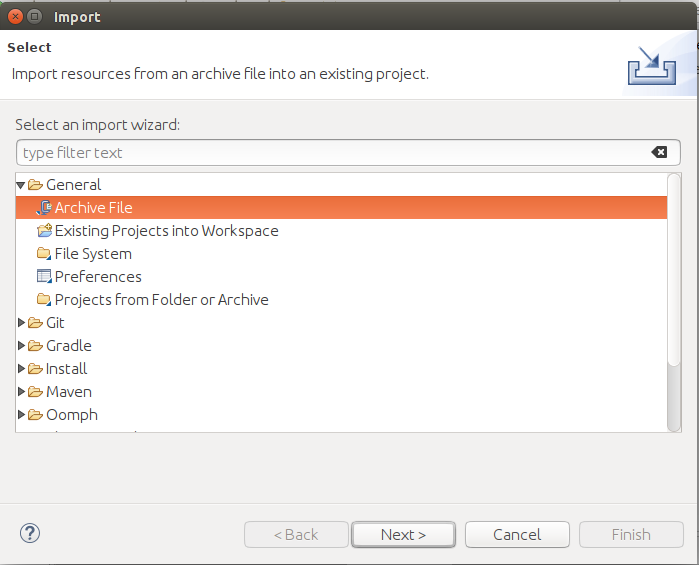

Navigate to where you have downloaded and unzipped the lab files and select `<EMF_LABS>/labs/labfiles/addressbook_java_code.zip`

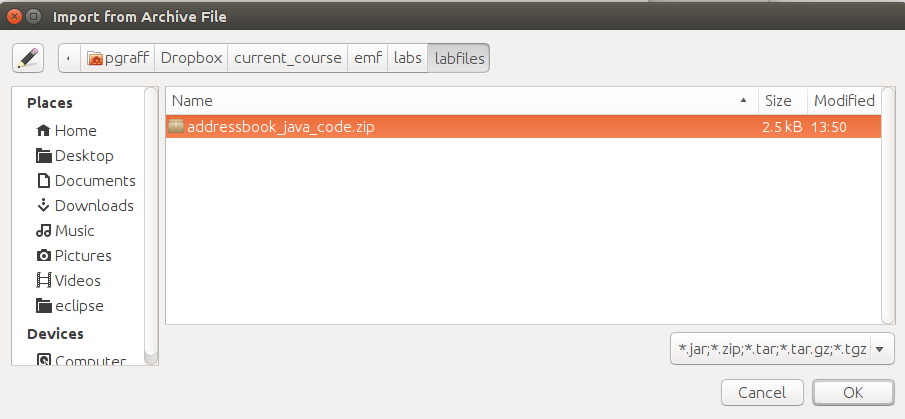

Press `OK`.

Make sure you also select the source directory (`src` by default) as the `Into Folder`:

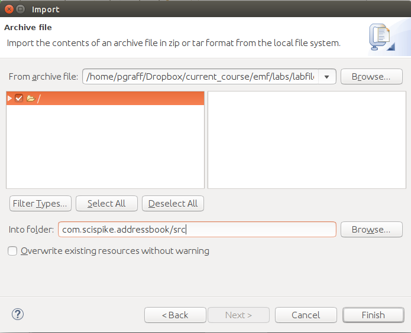

And finally press `Finish`.

## 3. Study the code

The code that you imported is just some simple Java code.
The only thing we've provides are the interfaces to a proposed implementation of an address book.

Let's just take a look at one of the interfaces:

```Java

package com.scispike.addressbook;

/**
 * The address holds a location used to visit or
 * for mailing.
 *
 * @model
 */
public interface Address {

    /**
     * Retrieve the name used for this address
     * @model
     */
    public String getAddressee();

    /**
     * Retrieve the street address
     * @model
     */
    public String getStreet();

    /**
     * Retrieve the zip code
     * @model
     */
    public String getZipCode();

    /**
     * retrive the city
     * @model
     */
    public String getCity();
}

```

Notice that the code is quite simple.
We have declared a type `Address` and provided some getter methods for each of the properties we think an address may provide.

One thing to take a note of is the comments.
Notice that the comments have an anotation `@model`.

Take a look at the other interfaces as well and make sure there is nothing magical in the code.

## 4. Create a generator model

In this step we'll create something called a generator model.
It is not important that you know what this is at this point.
We'll explain it all soon.
For now, all you have to do is to follow the steps.

Right click on the `model` folder (this folder is reserved for holding your model files) and select `New` --> `Other`.

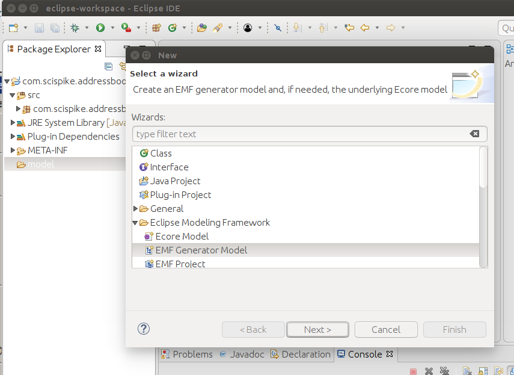

Select  the option `Eclipse Modeling Framework` --> `EMF Generator Model`, then select `Next`.

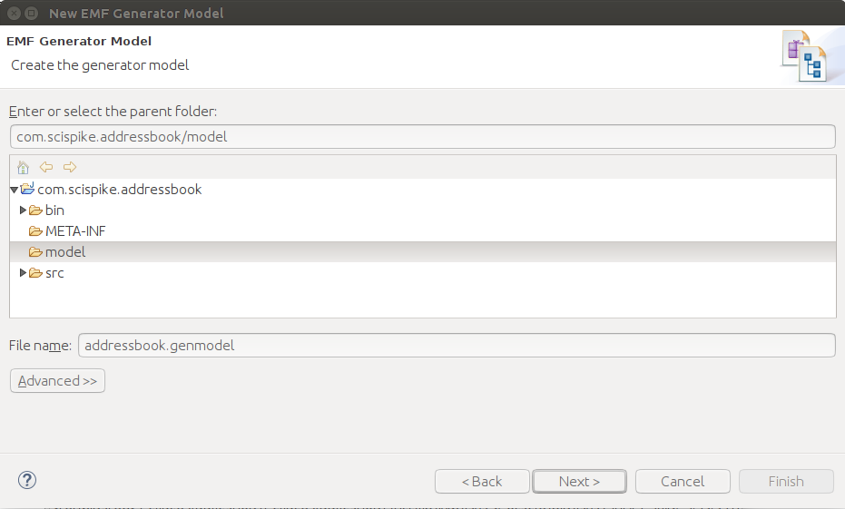

Name the file `addressbook.genmodel` and click `Next`.

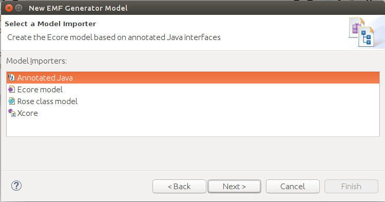

Select `Annotated Java` and press `Next`.

The final step is just a confirmation and you should see something similar to the picture below.

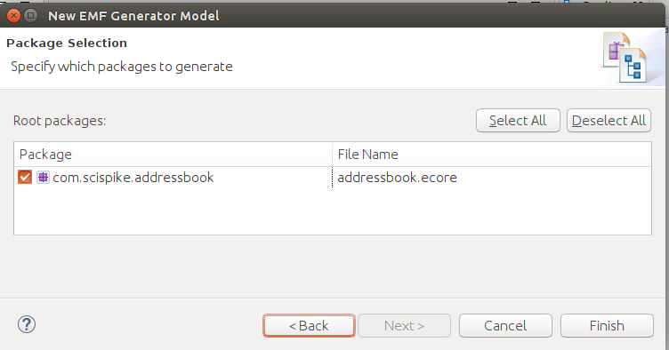

Just press `Finish` and we should have created all the models.

## 4. Take a stock of what we have so Framework

At this point, we should have the following artifects.

* The interface files that we imported (in the `src/` directory)
* The genmodel that we just created (in the `model/` directory)
* An ecore model that was created along with the genmodel (in the `model/` directory)

The two model files we just created we'll discuss in much details later in this course.
For now, all you need to know is that they make up your code generator preferences and a logical model of some data structure that we think may work for an address book.

## 5. Generate some code

Now for the fun stuff.

We want to create a plugin for Eclipse that allows us to keep track of addresses based on the interface model that we imported.

Start with the genmodel open, right-click on the `Addressbook` Root element and select `Generate All`.

You should now see a few more projects being added to your workspace.

As a result, you should have 4 projects:

* The original project `com.scispike.addressbook`
* A project called `com.scispike.addressbook.edit`
* A project called `com.scispike.addressbook.editor`
* A project called `com.scispike.addressbook.test`

Take a moment to browse the code.
Depending on how experienced you are writing eclipse plug-ins, you will have more or less understanding of the code.
In this course, we'll examine what is generated in detail, but for now, let's move on to trying out the new plugin.

## 6. Start a test environment

Eclipse provides us with the ability to try out any new plugin that we may write.

To test out a new plugin, Eclipse launches a new instance of Eclipse on a new workspace with the plugin contributions you have in the current workspace added as a new contribution.

To launch the test instance of Eclipse, all you have to do is to right click on any of t he projects and select `Run As` --> `Eclipse Application`.

 You should now have two running instances of Eclipse. The one which we used to develop and the one that we'll use to test.

## 7. Create an address book

To see if your newly generated editor works, you should be able to create a project in the test instance of Eclipse and add a file.

Right click on navigator and select `New` --> `Project...`.
It doesn't really matter which kind of project you pick, but as an example, let me pick `General` --> `Project`.

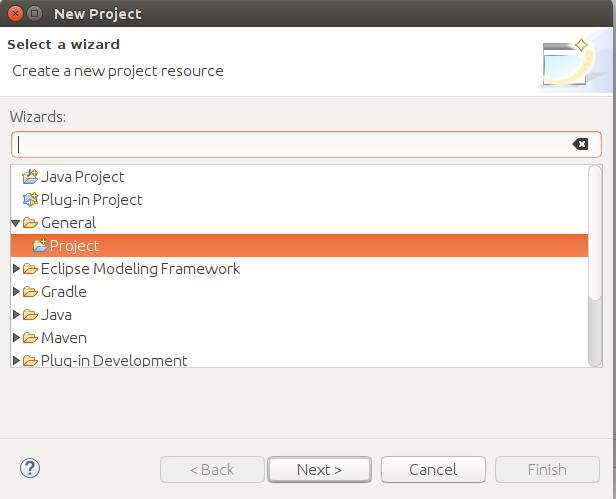

Click `Next`

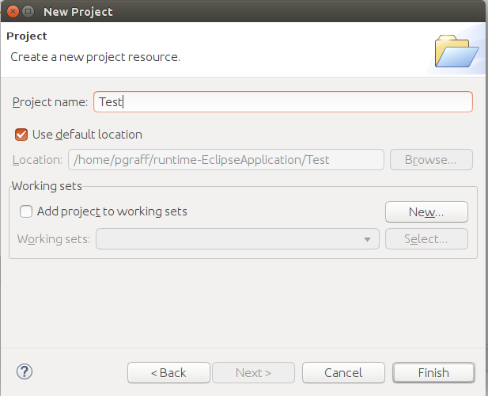

Select some name (e.g., `Test`) and click `Finish`.

Now we have a place to place our test files (address books).

Right-click on the newly created test project and select `New` --> `Other`.

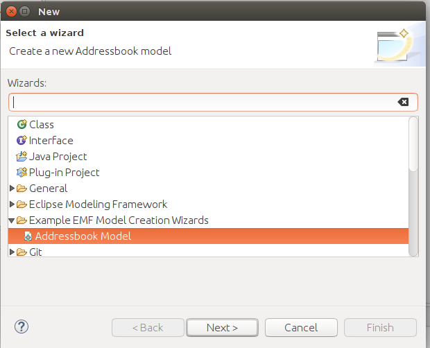

Select `Example EMF Model Creation Wizards` --> `Addressbook Model`.

Click on `Next`.

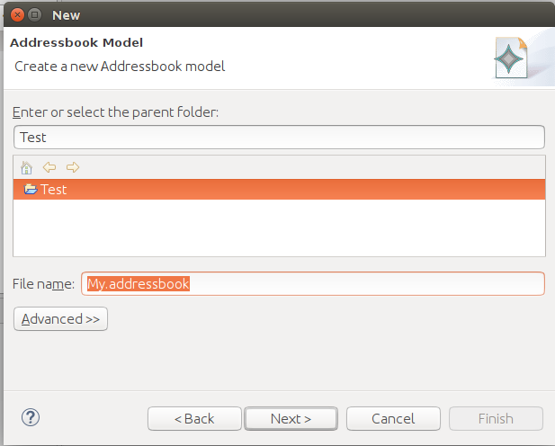

Name the addressbook file (just make sure the file extension is `addressbook`).
E.g., `My.addressbook`.

Click on `Next`.

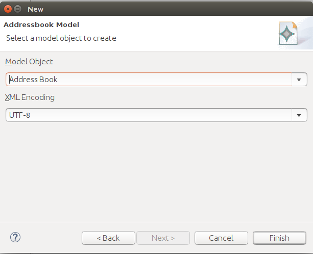

Select `AddressBook` as the Model object (and UTF-8 as the encoding)

Click `Finish`.

You should now have created a new file with the extension `addressbook` and an an editor to edit this file should have opened.

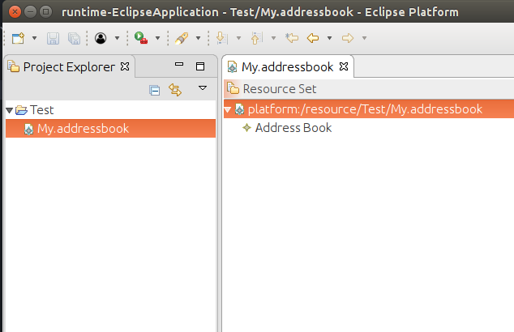

## 8. Setup editing

The generated editor uses the user-interface idioms of Eclipse.
The editor will use a tree editor to show you the structure of the file and a property sheet to edit the properties of the objects that makes up the structure.

Let's start by enabling the property sheet (if you don't already have that open).

Right click on the editor and select `Show Properties View`

You should now have the ability to edit properties.


## 9. Play with the editor

You should now be able to add entries to your address book.

* To add a new entry, right-click on the address book and select `New Child` --> `Individual` or `Business`
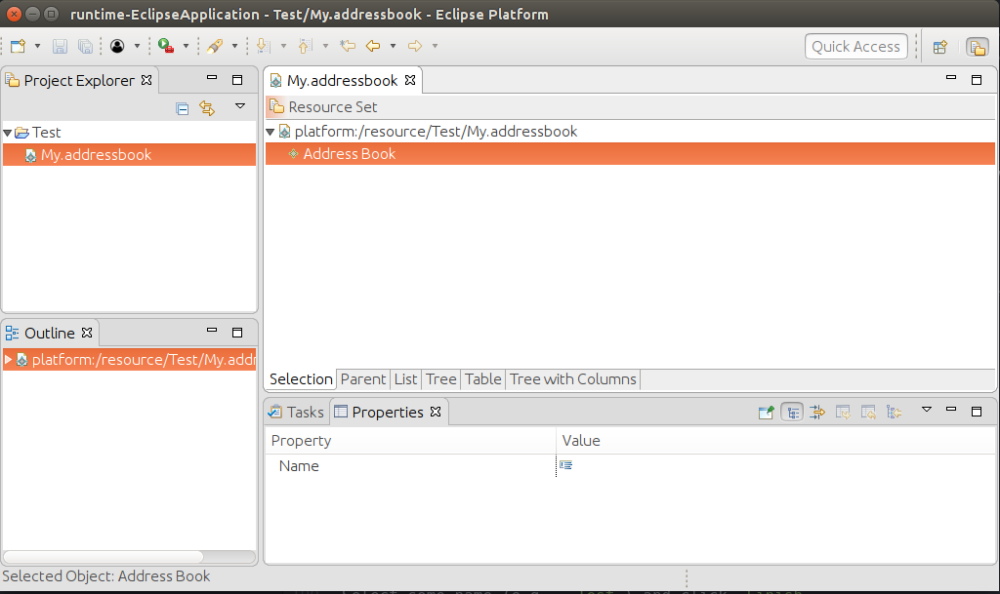
* Try right-clicking on the elements in the address books as well, what can you do?
* To edit the properties, select the item in the tree structure and edit the properties
* Try out undo and redo as well.


## Congratulations

You've created your first Eclipse Editor using EMF.
