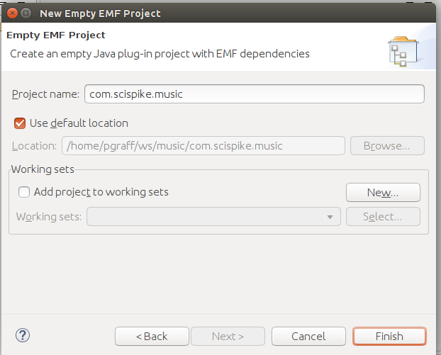
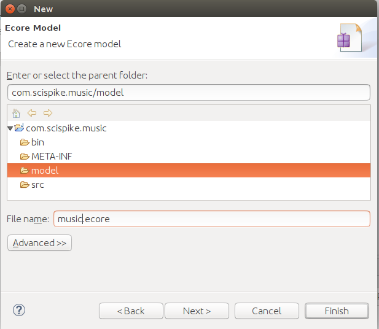
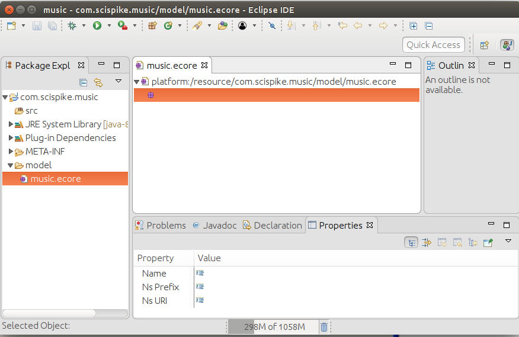
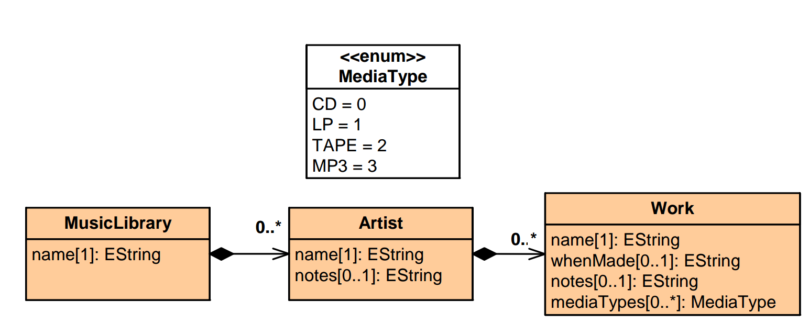

# Music LIbrary Editor Using `ecore`

## Introduction

In this lab, we will build the ecore model for the music library discussed in the presentations.
We will create the business model using the built-in ecore editor.

## 1. Create a new project

You may want to start with a blank workspace, but you can also continue from where you were before.

Start by creating a new EMF project. We'll follow almost the same steps as before, so we'll not add clutter with screen shots unless there is something new.

Start by Creating an Empty EMF Project

1. Right-click on the navigator and select `New` --> `Project`
2. Select `Eclipse Modeling Project` --> `Empty EMF Project`

3. Name the project `com.scispike.music` and press `Finish` to complete the creation of the project

We have now created an EMF project.
This project is setup correctly, but no `ecore` or `genmodel` is present.
The key differences between this project and a standard Java project are:

* Eclipse has added a so called `nature` and builders to incrementally take actions on EMF artifacts. These natures and builders include plug-in development and emf.
* The project is setup with a directory called `model`

The next steps show you how to create the ecore model.

## 2. Create a new `ecore` model

Right-click on the `model` folder and select `New` --> `Other`.

Select `Eclipse Modeling Framework` --> `Ecore Model` and press `Next`.

Name the model file `music.ecore` and press `Finish`.

  In older versions of Eclipse, you may experience that you can not directly click `Finish` and you have to select press next and then select a root element.
  If you experience this, you must select `EPackage` as the root element.

## 3. Make sure you can use the editor

You now should have an editor with the music.ecore file open.

This editor allows you to edit the model using a tree structure.
You will also have to have the properties view open. Ideally, your Eclipse environment should now look something like this:

## 4. Populate the model

Using the ecore editor, enter the music example as shown in your slides. Below is the
class diagram for the music library.

## Summary

You should now have a working EMF model.
We will need one more model to make it possible to generate something, but for now, we'll simply leave  the model complete and move on to the genmodel.
