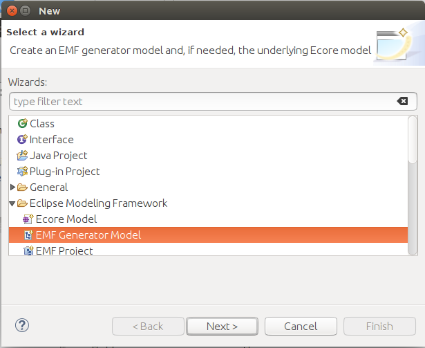
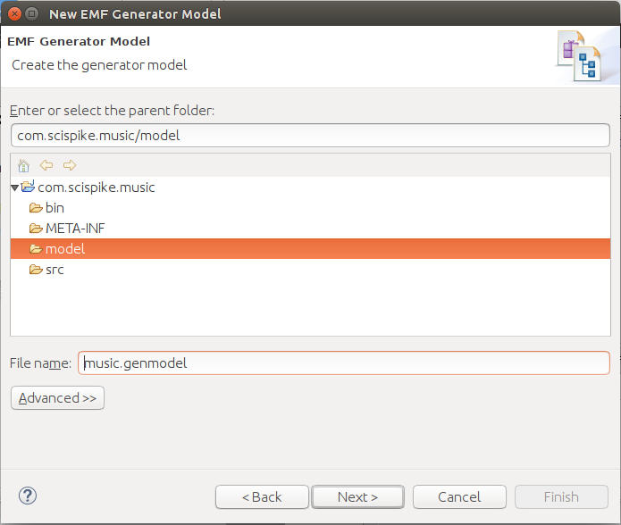
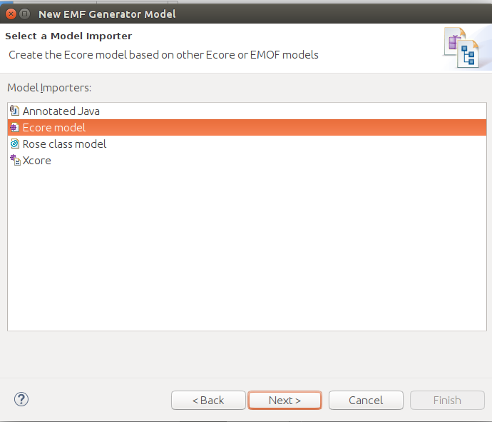
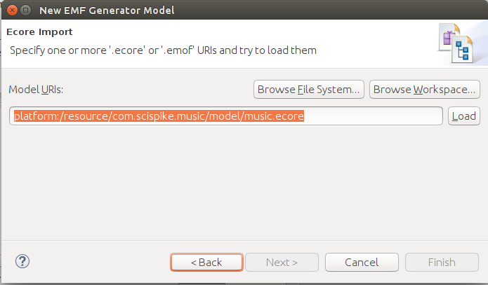
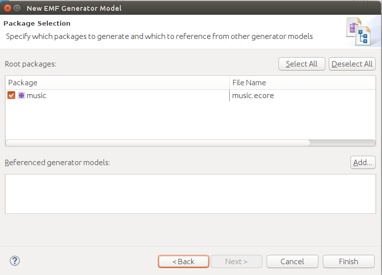

# Generate the music library

## Prerequisites

This lab assumes that you successfully created an ecore model in the previous exercise.

If you didn't create the ecore model or for some other reason lost the ecore mode, we have a starting point for you.
In the directory `<ECLIPSE_LABS>/labs/labfiles/` you should have an example of a music.ecore file.
You would then have to get started with the following steps:

1. Create an empty EMF project
2. Import the music.ecore model into the model directory.

## Introduction

In this exercise, our goals are to gain some experience with:

* Creating `genmodels`
* Generating code

We'll use the `ecore` model from the last exercise as the input for the `genmodel`.

Most of what we'll do in this exercise, you have done once before when we created the `addressbook`.

## 1. Create the `genmodel`

Right the `music.ecore` in the navigator (not strictly necessary, but it makes the creation wizard pick better defaults) and select `New` --> `Other`.

Select `Eclipse Modeling Framework` --> `EMF Generator Model` and press `Next`.

If you started by right-clicking on the `music.ecore` model, everything should be all set, but just for completeness,

* Name your genmodel `music.genmodel`
* Place the model in the directory `model/`

Click `Next` to get to the next page of the creation wizard.

Select `Ecore model` and click `Next`.

The tool will ask you where your `ecore` file is (again if you started with the `music.ecore` model selected, you should see the model selected).

You will have to load the model to enable the next step.
Click on `Load` and you should see the `Next` button being enabled.

If the Next button does not become enabled after you press `Load`, it is typically because you have an error in your `ecore` model. Try to figure out what the error is or ask your instructor to help.

When you succeed at clicking on the `Next` button, you should see something like this:

You can now simply click on `Finish` to complete the creation of the `genmodel`.

## 2. Generate the code

To generate the code, you can simply right-click on the Music root inside the `genmodel` and select `Generate All`.

After a few seconds you should be able to observe all the new projects and the newly generated code.

## 3. Test the editor

We've seen this before, but the steps are:

1. Right-click on one of the projects
2. Select `Run As` --> `Eclipse Application`
3. Create a new project in the new instance of Eclipse
4. Add a new Music file using the Music Model wizard
5. Populate the music file with your favorite music/artists

## Summary

We have now taken an ecore model file and created a genmodel that "decorates" the ecore model with code generation properties.
We used this genmodel to generate an set of Eclipse Plugins.
