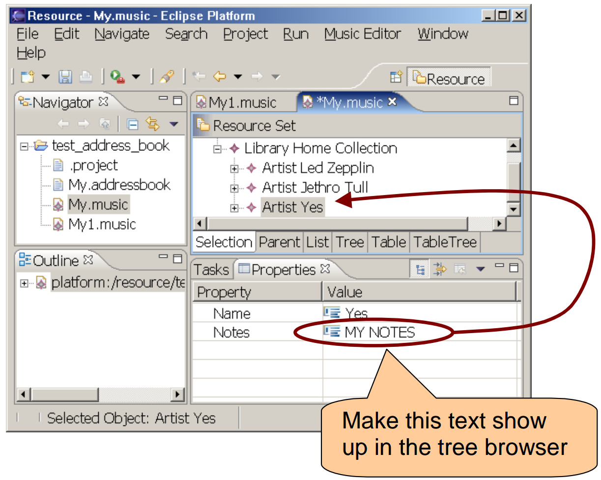

# Modify the `genmodel`

## Introduction

The `genmodel` allows you to set options for how EMF generates the plugin code.
The goal of this exercise is to allow you to play around with these code generator options.

We will not provide you with steps to follow in this exercise.
Instead, we'll just explain the goals and let you try to figure out what options to change.

## Step 1: Goal A

Insert a copyright text for all the source code to ```"© <Your company name> <This Year>"```


## Step 2: Goal B

Use the notes field instead of the name field for displaying artists.


