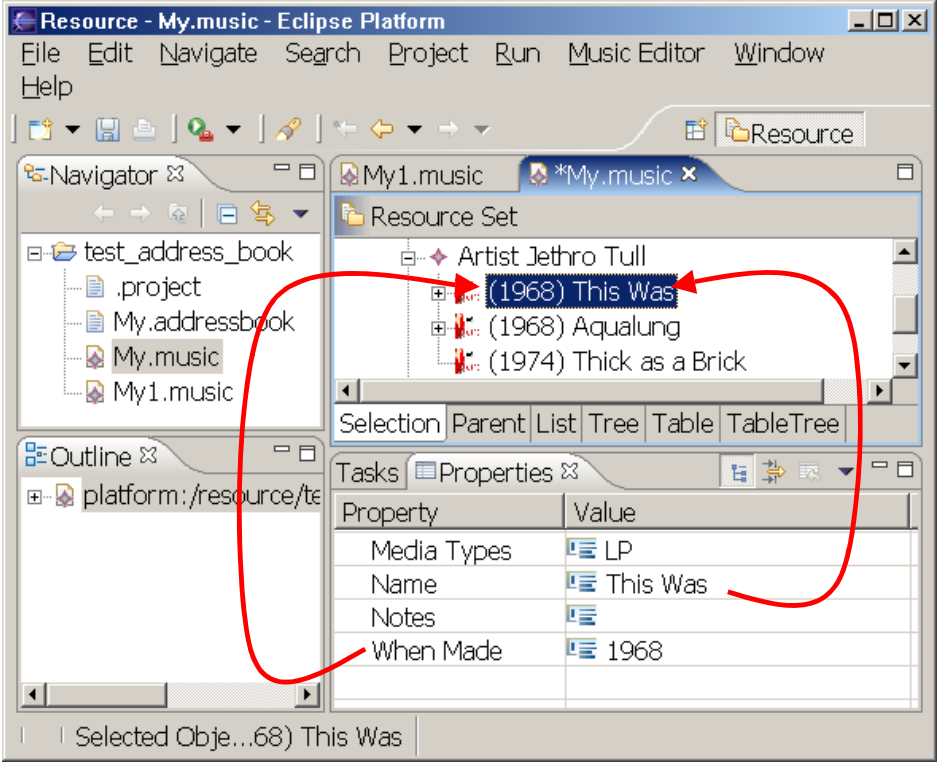

# Override the label provider

## Instructions

We have seen how we can change the `genmodel` to specify which attribute represents an object in the tree browser.
The genmodel allowed us to pick a single attribute field; however, sometimes we need a more complex algorithm to provide the string representation.

In this exercise, we'll change the format of the tree browser text for the work objects.
We would like for the work object to be represented in the tree browser as a combination of two fields, the whenMade and the name fields should be concatenated according to the below pattern `"(<whenMade>) <name>"`.

To do this, you will have to manually modify code.
This time, we'll leave you with no explicit steps of how to do this... but a few hints might be in order :-)

* Remember that there is an adapter for each of the model objects in the generated EMF.edit plugin.
  This may be a good place to start...
* Don't forget the `@generated` tag...
