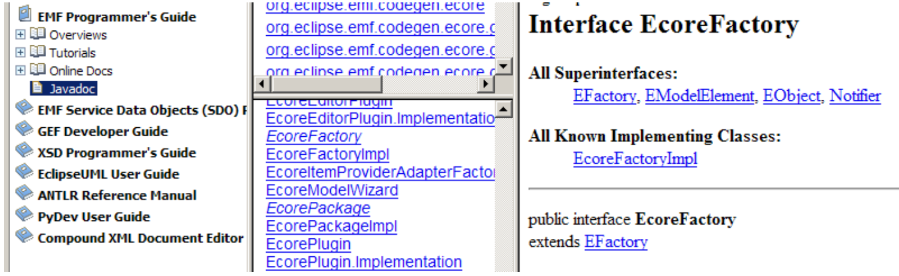

# Use reflective EMF operations

## Introduction

In this exercise we will be using reflective EMF operations.
We will be creating classes on the fly, defining their attributes and relationships.
Eventually we will be creating the instances of dynamically created classes.
The goal of this exercise is to make you familiar with the reflective style of programming – something that few business developers do, but what is common in tools development.

Using dynamic EMF is fairly straightforward.
The methods are similar to what we already encountered in the client EMF programming, only the methods will be creating instances on the meta-level.
First we will need to get familiar with the methods that will create instances of `Ecore` classes at runtime.
In order to do that, open Eclipse Help and go to EMF JavaDoc.
Find the interface `EcoreFactory` and examine its methods.



You will see that this interface creates instances of other Ecore classes, such as EcorePackage and EcoreClass.
They have interesting methods too.
Check them out!

## Instructions

Consulting the JavaDoc help, create a structure for another music library.
The steps are:

1. Create an instance of `EPackage` and give it a name “musiclibrary2”.
2. Create an instance of `EClass` and give it a name “MusicLibrary2”.
3. Add an attribute, and give it a name “name”.
4. Continue by adding a class for the Artist. Add an attribute for the name.
5. Add a reference from `MusicLibrary` to the `Artist`.

This will define enough of the structure for now.
Next, we can create some instances.
We want to create an instance of MusicLibrary2 and use it as an ordinary object in our application.
You will need to consult the JavaDoc for the suitable methods.

6. Create an instance of the factory for the package `musiclibrary2`.
  (You remember that we always create instances through factories.) Method `getEFactoryInstance`
would help here.
  You may want to set the values for NsPrefix and NsURI (which are used in serialization).
7. Create a variable `classicalLibrary`.
   Its type will be `EObject` – we cannot tell more about it at the compilation time.
8. Ask factory to create an instance for a class MusicLibrary2 and assign it to the variable.
9. Set the value of the name using the `eGet` operation.
10. Proceed by creating instance for an artist. Give it a name, for example “Bach”.
11. Set a reference from the music library to the artist.

Now we have couple of instances of classes created at runtime!

We can examine the resulting object graph by serializing it.
Use the serialization code you developed in the previous exercise to save the content in a file `MusicLibrary2.music2`

If you open it, you should see the following content:

```xml
<?xml verfsion="1.0" encoding="UTF-8"?>
<musiclibrary2:MusicLibrary2 xmi:version="2.0" xmlns:xmi = h1">
  <artists name="Bach"/>
</musiclibrary2:MusicLibrary2>
```
