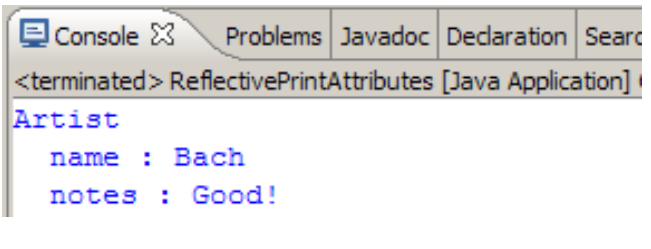
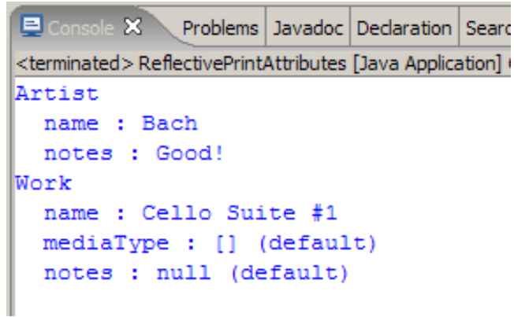

# Implement reflective method

## Introduction

In this exercise we will use the EMF reflection to develop a method that prints attributes of any object:

```java
public static void printAttributes(EObject object) {
…
}

```
For example, if we set up our instances in the following way:

```java
public static void main(String[] args) {
  MusicLibrary ml =
  MusiclibraryFactory.eINSTANCE.createMusicLibrary();
  // Create an artist
  Artist a = MusiclibraryFactory.eINSTANCE.createArtist();
  a.setName("Bach");
  a.setNotes("Good!");
  // Create a work
  Work w = MusiclibraryFactory.eINSTANCE.createWork();
  w.setName("Cello Suite #1");
  // Add the work to the artist
  a.getWorks().add(w);
  // Add the artist to the music library
  ml.getArtists().add(a);
  //Print all the attributes
  printAttributes(a);
  printAttributes(w);
}
```

You should have the output at the console like this:



Notice that `printAttributes` works for instances of any classes; we do not know the exact classes and we cannot (and do not want to!) hard code the names of the attributes.
Use EMF reflection to write the method. Viewing JavaDoc help for `EClass` will be helpful.
For bonus points, next to the value of the attribute, you can print if this is the value set by default.
Hint: find a suitable method that knows if the attribute was set.
Then your output will look like this:


