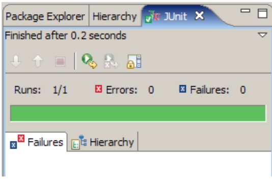

# Using JUnit to test EMF code

## Introduction

From EMF 2.1, EMF added the ability to generate `JUnit` tests for the EMF applications.
You have probably already noticed the existence of the plugin project `com.scispike.music.tests`.
It contains `JUnit` test classes for each of the classes that we have generated.
In addition, for every `EOperation` there is a generated test method which needs to be redefined.

In this exercise, explore the generated unit tests.
Create an `EOperation` and then write a unit test for it.

You can compare expected and actual values in the test by using method `assertEquals`.

You can conveniently run your JUnit tests through a two-key shortcut:` Alt-Shift-X T`

The result is a familiar JUnit view showing the success of test execution.
